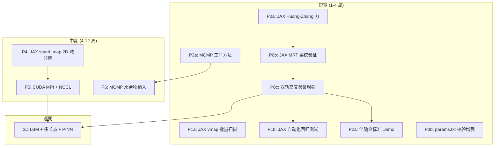

# Phase 6: 双轨深化 — 下一步实施计划

> **日期**: 2026-07-22
> **依赖**: Phase 1-5a 完成 · 双轨架构已确立
> **参考**: JAX-LaB 源码 + 学习指南（`~/software/JAX-LaB/`）

---

## 目录

1. [当前状态总览](#1-当前状态总览)
2. [JAX-LaB 可借鉴的十条经验](#2-jax-lab-可借鉴的十条经验)
3. [下一步任务矩阵](#3-下一步任务矩阵)
4. [P0: JAX 轨物理对等化（短期 · 2-4 周）](#4-p0-jax-轨物理对等化短期--2-4-周)
5. [P1: AI 自动调参沙盒基础设施（短期 · 1-2 周）](#5-p1-ai-自动调参沙盒基础设施短期--1-2-周)
6. [P2: 伴随金标准验证管线（短期 · 1-2 周）](#6-p2-伴随金标准验证管线短期--1-2-周)
7. [P3: Python 抽象层完善（短期 · 1 周）](#7-p3-python-抽象层完善短期--1-周)
8. [P4: 多 GPU 验证轨（中期 · 3-6 周）](#8-p4-多-gpu-验证轨中期--3-6-周)
9. [P5: CUDA 生产轨多 GPU（中期 · 4-8 周）](#9-p5-cuda-生产轨多-gpu中期--4-8-周)
10. [P6: MCMP 水合物纳入统一框架（中期 · 2-3 周）](#10-p6-mcmp-水合物纳入统一框架中期--2-3-周)
11. [依赖关系与时间线](#11-依赖关系与时间线)

---

## 1. 当前状态总览

### 1.1 已完成

| Phase | 内容 | 状态 |
|-------|------|------|
| 1 | Python 抽象层 (`lbm_mrt/unified/`) | ✅ |
| 2 | CUDA 运行时网格 (unified binary, 35 处 guard) | ✅ |
| 3 | JAX 可微 LBM 验证工具 (`jax_lbm/`) | ✅ |
| 4 | 统一 CLI (`lbm models/info/run/validate`) | ✅ |
| 5a | MCMP 模型注册 (2 个模型) | ✅ |

### 1.2 JAX 轨当前能力

| 模块 | 文件 | 状态 |
|------|------|------|
| D2Q9 格子 | `jax_lbm/lattice.py` | ✅ |
| 5 种 EOS | `jax_lbm/eos.py` | ✅ CS/PR/RK/RKS/VdW |
| BGK 碰撞 | `jax_lbm/collision.py` | ✅ |
| MRT 碰撞 | `jax_lbm/collision.py` | ✅ 矩阵已定义，待系统验证 |
| Shan-Chen 力 | `jax_lbm/force.py` | ✅ |
| Huang-Zhang 力 | — | ❌ **缺失** |
| 5 种 BC | `jax_lbm/boundary.py` | ✅ |
| Scheme IV 润湿 | `jax_lbm/wetting.py` | ✅ |
| 交叉验证套件 | `jax_lbm/validate_against_cuda.py` | ✅ 4 项基础验证 |
| `jax.grad` 穿透 | `d2q9_bgk.py` | ✅ BGK 已验证 |
| `jax.vmap` 批量扫描 | — | ❌ **缺失** |
| 自动化回归测试 | — | ❌ **缺失** |

### 1.3 关键差距：JAX vs CUDA 物理不对等项

```
CUDA 生产轨                    JAX 验证轨
─────────────────────────────────────────────
MRT + Huang-Zhang 三阶力  ←→  BGK + Shan-Chen 力  ⚠️ 不对等！
Scheme IV ψ-ghost BC      ←→  Scheme IV ψ-ghost BC  ✅
CS-EOS (Huang SCMP)       ←→  CS-EOS                ✅
PR-EOS (MCMP)             ←→  PR-EOS                ✅
水合物热-浓度-VOP          ←→  ❌                    合理缺失
多孔介质                   ←→  ❌                    合理缺失
```

**核心洞察**：JAX 轨缺少 **Huang-Zhang 三阶力修正**，这是当前双轨之间最大的物理不对等。BGK vs MRT 的差异可以接受（只要碰撞可独立验证），但力模型的不同意味着 JAX 不能完整复现 CUDA 的 SCMP 行为——这削弱了 Debug 加速和金标准验证的价值。

---

## 2. JAX-LaB 可借鉴的十条经验

> 来源：`~/software/JAX-LaB/JAX-LaB-学习指南.md` §10 + 源码分析

### 2.1 立即可用于当前框架的（不改 CUDA）

| # | 经验 | JAX-LaB 做法 | 应用到 huang_mrt_2d |
|---|------|-------------|-------------------|
| 1 | **参数集中管理** | `PrecisionPolicy`、`gridInfo` 统一存储 | ✅ 已有 `ModelDefinition`，继续完善工厂方法 |
| 2 | **参数验证前置** | `@property.setter` 在 `__init__` 中校验 | ⚠️ 部分已有 `__post_init__`，需补全 MCMP 校验 |
| 3 | **EOS 独立成模块** | `eos.py` 纯函数 + 注册表 | ✅ JAX 轨已有；CUDA 轨建议抽到 `eos.cuh` |
| 4 | **碰撞模型可插拔** | `BGKSim`/`MRTSim` 继承 `LBMBase` | 📋 CUDA 轨重构方向 |
| 5 | **组件数组化** | PyTree `tree_map` 多组分统一操作 | 📋 CUDA 轨 `FluidDev fluids[MAX]` |

### 2.2 直接指导 JAX 轨建设的

| # | 经验 | 具体做法 |
|---|------|---------|
| 6 | **`lax.scan` 可微时间循环** | 替代 Python `for`，恒定内存记录 50000 步计算图 |
| 7 | **EDM 力施加** | `f_out = f_coll + [f_eq(u+F/ρ) - f_eq(u)]`，比直接 `f += F` 精确 |
| 8 | **`shard_map` 多 GPU** | 声明式网格映射，~10 行替代 ~200 行 MPI |
| 9 | **`vmap` 批量参数扫描** | 单卡上并发跑 N 组参数，自动向量化 |
| 10 | **PyTree 多组分** | `tree_map(lambda f: collision(f), f_tree)` 替代手写 for 循环 |

---

## 3. 下一步任务矩阵

```
优先级    任务                       轨道      工作量    依赖
─────────────────────────────────────────────────────────────
P0 🔴    JAX Huang-Zhang 力实现      JAX       2-3 天    无
P0 🔴    JAX MRT 系统验证            JAX       1-2 天    P0 力
P0 🔴    双轨交叉验证增强            双轨      2-3 天    P0 力 + MRT
P1 🟡    JAX vmap 批量参数扫描       JAX       1 天      无
P1 🟡    JAX 自动化回归测试套件      JAX       2-3 天    P0
P2 🟢    伴随金标准 Demo             JAX       1-2 天    P0
P3 🔵    MCMP 工厂方法补全           Python    1 天      无
P3 🔵    params.txt 校验增强         Python    1 天      无
P4 🟠    JAX shard_map 2D 域分解     JAX       3-5 天    无
P5 🟠    CUDA MPI + NCCL 域分解      CUDA      1-2 周    P4 (验证)
P6 🟣    MCMP 水合物统一框架纳入     Python    2-3 天    无
```

---

## 4. P0: JAX 轨物理对等化（短期 · 2-4 周）

> **目标**: JAX 轨的力模型与 CUDA 轨对等，使 JAX 能完整复现 SCMP 行为
> **价值**: 解锁 Debug 加速 + 伴随金标准的全部潜力

### 4.1 任务 P0a: JAX Huang-Zhang 三阶力修正

**当前状态**: `jax_lbm/force.py` 只有 `shan_chen_force()`。

**目标**: 新增 `huang_zhang_force()`，与 CUDA `compute_molecular_force_scmp()` 物理等价。

**参考**: CUDA 轨 `LBM.cu` 中的实现 + Huang & Wu (2016) Eq.(23)-(27)

**实现位置**: `jax_lbm/force.py`

```python
# 新增函数签名
def huang_zhang_force(psi, epsilon=1.7, k2=0.0, kd=0.0):
    """Huang & Wu (2016) 三阶力修正.

    与 CUDA compute_molecular_force_scmp 物理等价。

    F = F_SC + F_3rd
    F_SC = -G·ψ·Σ w_k·ψ(x+c_k)·c_k           (Shan-Chen 一阶)
    F_3rd = ε·(Q_m + k2·S + kd·K)             (三阶修正)

    Parameters
    ----------
    psi : (nx, ny, 1) array
    epsilon : float — 表面张力调节 (经验值 1.7)
    k2 : float — 二阶各向异性修正
    kd : float — 密度梯度修正

    Returns
    -------
    F : (nx, ny, 2) array
    """
    # Step 1: SC 基础力
    psi_s = _stream_field(psi)
    F_sc = -(-1.0) * psi * jnp.dot(G_FF * psi_s, C.astype(jnp.float64))
    # G = -1.0 硬编码（CS-EOS 标准值）

    # Step 2: Q_m 项 — 三阶各向同性修正
    # Q_m 基于 ψ 的四阶梯度
    Q_m = _compute_Q_huang(psi)

    # Step 3: S 项 — 二阶各向异性修正 (k2 ≠ 0 时启用)
    S = _compute_S_huang(psi) if k2 != 0.0 else 0.0

    # Step 4: K 项 — 密度梯度修正 (kd ≠ 0 时启用)
    K = _compute_K_huang(psi) if kd != 0.0 else 0.0

    return F_sc + epsilon * (Q_m + k2 * S + kd * K)
```

**CUDA 对照表**（翻译时逐项对齐）:

| JAX 函数 | CUDA 内核 | 验证方法 |
|----------|----------|---------|
| `_compute_Q_huang()` | `compute_Q_huang_gpu()` | 同 ψ 场下对比 Q 值 |
| `_compute_S_huang()` | `compute_S_huang_gpu()` | 同 ψ 场下对比 S 值 |
| `huang_zhang_force()` | `compute_molecular_force_scmp()` | 同 ρ 场下对比 F 矢量 |

**验证策略**:
```python
# 在 128² 网格上：
# 1. 用相同初始液滴运行 CUDA 1 步 → 导出 ψ 和 F
# 2. 在 JAX 中用相同 ψ 调用 huang_zhang_force → 对比 F
# 3. assert jnp.allclose(F_jax, F_cuda, rtol=1e-5)
```

### 4.2 任务 P0b: JAX MRT 碰撞系统验证

**当前状态**: `jax_lbm/collision.py` 已定义 `MRT_M`、`MRT_MINV`、`MRT_S_DEFAULT` 和 `collision_mrt()` 函数。

**目标**: 系统验证 JAX MRT 碰撞与 CUDA `mrt_collide_single_component_gpu()` 数值一致。

**验证清单**:

| 验证项 | 方法 |
|--------|------|
| M 矩阵正交性 | `jnp.allclose(M @ Minv, I_9x9)` |
| τ=1.0 时碰撞 = 平衡态 | `collision_mrt(f, ω=1.0) ≈ feq` |
| τ=0.5 时 f_out 有界 | 100 步后无 NaN/Inf |
| 与 CUDA 同 τ 精度对比 | 同 f_init → 1 步碰撞 → 对比 f_out |

**松弛参数对齐**:
```python
# CUDA 轨: tau_huang=1.5 → 运动粘度 ν = cs²(τ-0.5) = 1/3
# JAX 轨: omega = 1/tau = 0.667

# MRT 松弛矩阵 S 的对角元:
# s_ρ = s_j = 0  (守恒量不松弛)
# s_e = s_ε = s_q = s_ν = 1/τ  (非守恒量)
# s_p = 1/τ (应力张量)
```

### 4.3 任务 P0c: 双轨交叉验证增强

**当前状态**: `validate_against_cuda.py` 有 4 项基础验证。

**目标**: 新增以下验证项，覆盖力模型和 MRT 碰撞：

```python
# 新增验证项
def validate_huang_force_equivalence():
    """验证 JAX Huang-Zhang 力与 CUDA 一致"""
    # 1. 用相同 ρ 场生成 ψ
    # 2. 分别计算 JAX 和 CUDA 的 F
    # 3. 逐格点对比相对误差 < 1e-5

def validate_mrt_collision_alignment():
    """验证 JAX MRT 碰撞与 CUDA MRT 碰撞一致"""
    # 同 f_init + 同 τ → 1 步碰撞 → 对比 f_out

def validate_contact_angle_matrix():
    """验证 θ=0°/30°/60°/90°/120°/150°/180° 的接触角"""
    # 在 JAX 中跑 2000 步 → 测量稳态接触角 → 对比 CUDA

def validate_laplace_law():
    """验证 ΔP = σ/R (Laplace 定律)"""
    # 不同 R₀ 的液滴 → 测量 ΔP → 线性拟合 → σ
```

---

## 5. P1: AI 自动调参沙盒基础设施（短期 · 1-2 周）

> **目标**: 让 AI agent 能在 JAX 沙盒中安全地迭代新模型
> **价值**: Loop Engineering 闭环的基础设施

### 5.1 任务 P1a: JAX `vmap` 批量参数扫描

**当前状态**: 无 `vmap` 使用。

**目标**: 一键并发扫描参数空间。

**实现**:
```python
# jax_lbm/parameter_sweep.py (新文件)

from functools import partial
import jax
import jax.numpy as jnp

@partial(jax.jit, static_argnames=('nx', 'ny', 'n_steps'))
def batch_run_lbm(params_batch, nx=128, ny=128, n_steps=500):
    """vmap 批量 LBM 运行。

    Parameters
    ----------
    params_batch : dict of (N,) arrays
        每个 key 是一个长度为 N 的参数数组

    Returns
    -------
    results : dict of (N,) arrays
        每个 key 是一个长度为 N 的结果数组
    """
    def single_run(T, epsilon, G_ads):
        f0 = init_droplet(nx, ny, ...)
        f_final = run_lbm_scmp(f0, ..., T=T, epsilon=epsilon, G_ads=G_ads)
        rho_final = jnp.sum(f_final, axis=-1)
        mass = jnp.sum(rho_final)
        return mass

    # vmap 自动并行化
    batched_run = jax.vmap(single_run, in_axes=(0, 0, 0))
    return batched_run(
        params_batch['T'],
        params_batch['epsilon'],
        params_batch['G_ads']
    )

# 使用示例:
# 扫描 100 组 (T, ε) 组合，1 次 vmap 调用完成
T_vals = jnp.linspace(0.55, 0.90, 10)
eps_vals = jnp.linspace(1.5, 2.5, 10)
TT, EE = jnp.meshgrid(T_vals, eps_vals)
results = batch_run_lbm({
    'T': TT.ravel(),
    'epsilon': EE.ravel(),
    'G_ads': jnp.zeros(100),
})
```

### 5.2 任务 P1b: JAX 自动化回归测试套件

**目标**: AI 改完代码后一键验证所有物理正确性。

**实现**:
```
jax_lbm/tests/                    # 新目录
├── __init__.py
├── test_eos.py                   # EOS 压力曲线 × 5 种
├── test_collision.py             # BGK + MRT 碰撞守恒性
├── test_force.py                 # SC + Huang-Zhang 力
├── test_wetting.py               # 接触角矩阵
├── test_boundary.py              # 5 种 BC
├── test_conservation.py          # 质量/动量守恒
├── test_coexistence.py           # Maxwell 构造
├── test_regression.py            # 与 CUDA 基准对比
└── conftest.py                   # pytest fixtures
```

**关键测试模式**（借鉴 JAX-LaB 的属性验证）:
```python
# test_collision.py
def test_mrt_mass_conservation():
    """MRT 碰撞前后总质量不变"""
    f_init = init_equilibrium(rho, u)
    f_out = collision_mrt(f_init, omega=0.667)
    rho_in = jnp.sum(f_init, axis=-1)
    rho_out = jnp.sum(f_out, axis=-1)
    assert jnp.allclose(rho_in, rho_out, rtol=1e-10)

def test_bgk_mrt_consistency_tau1():
    """τ=1 时 BGK 和 MRT 结果一致（都退化为平衡态）"""
    f_bgk = collision_bgk(f, omega=1.0, F_zero)
    f_mrt = collision_mrt(f, omega=1.0, F_zero)
    assert jnp.allclose(f_bgk, f_mrt, rtol=1e-10)
```

---

## 6. P2: 伴随金标准验证管线（短期 · 1-2 周）

> **目标**: 用 `jax.grad` 出理论梯度，建立可复现的伴随验证流程
> **价值**: 论文方法论亮点 + 审稿人无法反驳

### 6.1 任务 P2a: 最小可微 LBM → 梯度 Demo

```python
# jax_lbm/adjoint_demo.py (新文件)

import jax
import jax.numpy as jnp
from jax_lbm.d2q9_bgk import run_lbm_scmp, init_droplet

def mass_loss_simulator(epsilon, T_reduced, n_steps=500):
    """端到端可微：参数 → LBM 模拟 → 质量损失率"""
    nx, ny = 64, 64
    omega = 1.0 / 1.5  # τ = 1.5

    Tc = 0.3773 * 1.0 / (4.0 * 1.0)
    T = T_reduced * Tc

    rho_g, rho_l = _find_coexistence(T_reduced)
    rho_init, u_init = init_droplet(nx, ny, radius=15.0,
                                     rho_l=rho_l, rho_g=rho_g)
    f0 = init_equilibrium(rho_init, u_init)

    eos_params = {'a': 1.0, 'b': 4.0, 'R': 1.0, 'T': T, 'G': -1.0}

    # 注意: 当前用 SC 力，P0 完成后切换为 Huang-Zhang 力
    f_final = run_lbm_scmp(f0, omega, eos_params, n_steps,
                           collision='bgk',
                           epsilon_huang=epsilon)  # P0 后可用

    rho_final = jnp.sum(f_final, axis=-1)
    mass_initial = jnp.sum(rho_init)
    mass_final = jnp.sum(rho_final)
    return (mass_initial - mass_final) / mass_initial  # 质量损失率

# 一键计算梯度
d_loss_d_eps = jax.grad(mass_loss_simulator, argnums=0)
d_loss_d_T = jax.grad(mass_loss_simulator, argnums=1)

# 在 (ε=1.7, T/Tc=0.70) 处的梯度
grad_eps = d_loss_d_eps(1.7, 0.70)
grad_T = d_loss_d_T(1.7, 0.70)
print(f"∂(mass_loss)/∂ε = {grad_eps:.6f}")
print(f"∂(mass_loss)/∂T  = {grad_T:.6f}")
```

### 6.2 任务 P2b: 伴随金标准验证流程

```
Step 1: JAX 自动微分 → 理论梯度 g* (机器精度)
Step 2: CUDA 有限差分 → 近似梯度 g_FD
Step 3: 对比 ||g* - g_FD|| / ||g*||
Step 4: 记录为论文 "JAX benchmark verification"

输出: research/adjoint_gold_standard_report.md
```

---

## 7. P3: Python 抽象层完善（短期 · 1 周）

> **目标**: 补全 Phase 5a 遗留的工厂方法 + params.txt 校验
> **价值**: 降低参数错误率，完善 MCMP 支持

### 7.1 任务 P3a: MCMP 工厂方法补全

**当前状态**: `phase5_mcmp_integration_plan.md` 中标记为未完成。

```python
# lbm_mrt/unified/components.py 新增

@dataclass(frozen=True)
class CollisionParams:
    # ... 现有字段 ...

    @classmethod
    def mcmp_mrt(cls, tau_p_a=0.593, tau_p_b=0.515, kappa=0.6):
        """MCMP MRT 碰撞工厂方法"""
        return cls(
            collision_type=CollisionType.MRT,
            tau_p_a=tau_p_a,
            tau_p_b=tau_p_b,
            kappa=kappa,
        )


@dataclass(frozen=True)
class WettingParams:
    # ... 现有字段 ...

    @classmethod
    def material_mapped(cls, theta_by_material, GAw_m=1.0/456.69, GAw_c=86.41):
        """MCMP 材料映射润湿工厂方法。

        Parameters
        ----------
        theta_by_material : dict[int, float]
            {material_id: contact_angle_degrees}
            1 = quartz, 2 = hydrate
        """
        return cls(
            wetting_type=WettingType.WALL_MATERIAL_MAP,
            theta_by_material=theta_by_material,
            GAw_m=GAw_m,
            GAw_c=GAw_c,
        )
```

### 7.2 任务 P3b: params.txt 前置校验增强

**借鉴 JAX-LaB 的属性验证模式**:

```python
# lbm_mrt/unified/components.py 扩展 __post_init__

@dataclass(frozen=True)
class CollisionParams:
    # ...

    def __post_init__(self):
        # τ 物理范围校验
        if self.tau is not None and self.tau <= 0.5:
            raise ValueError(
                f"τ={self.tau} ≤ 0.5，流体粘度将为负值。"
                f"τ 必须 > 0.5（BGK）或相应的 MRT 松弛参数 > 0"
            )
        # MCMP 对称性校验
        if self.tau_p_a is not None and self.tau_p_b is not None:
            # 虽然不是必须对称，但差异过大会报警
            pass

@dataclass(frozen=True)
class ForceParams:
    # ...

    def __post_init__(self):
        # GAB == GBA 对称性校验 (Shan-Chen 要求)
        if (self.GAB is not None and self.GBA is not None
                and abs(self.GAB - self.GBA) > 1e-10):
            raise ValueError(
                f"Shan-Chen 相互作用矩阵必须对称: "
                f"GAB={self.GAB} ≠ GBA={self.GBA}"
            )
```

---

## 8. P4: 多 GPU 验证轨（中期 · 3-6 周）

> **目标**: 用 JAX `shard_map` 在小网格上验证 2D 域分解通信模式
> **价值**: 消除 MPI 开发的通信 bug 风险

### 8.1 实现方案

**借鉴 JAX-LaB `base.py` 的 `shard_map` 模式**:

```python
# jax_lbm/sharded_lbm.py (新文件)

from jax.experimental.shard_map import shard_map
from jax.sharding import Mesh, PartitionSpec as P

def setup_2d_domain_decomposition(n_devices=2):
    """配置 2D X 方向域分解"""
    devices = jax.devices()[:n_devices]
    mesh = Mesh(devices.reshape(n_devices, 1), axis_names=('x', 'y'))
    return mesh

@partial(shard_map, mesh=mesh,
         in_specs=(P('x', 'y', None),),    # f: (nx/nDev, ny, 9)
         out_specs=P('x', 'y', None))
def step_sharded(f):
    """一个完整时步，JAX 自动插入 Halo 交换"""
    rho, u = macroscopic(f)
    psi = pseudopotential(rho, ...)
    F = shan_chen_force(psi, G=-1.0)
    f = collision_bgk(f, omega, F)
    # streaming 中的 jnp.roll 跨分片边界时，
    # shard_map 自动推断需要的 Halo 交换
    return streaming(f)

# 验证: 2 GPU 结果 vs 1 GPU 基准
def validate_sharded_vs_serial():
    f0 = init_droplet(128, 128, ...)
    # 单 GPU 基准
    f_serial = run_serial(f0, n_steps=100)
    # 2 GPU shard_map
    f_sharded = run_sharded(f0, n_steps=100, mesh=mesh)
    assert jnp.allclose(f_serial, f_sharded, rtol=1e-10)
```

### 8.2 JAX-LaB 借鉴点

JAX-LaB 的 `base.py` 在 `__init__` 中完成了完整的 shard_map 配置：

```python
# JAX-LaB 模式 (base.py ~L120-160)
self.devices = mesh_utils.create_device_mesh((self.nDevices, 1, 1))
self.mesh = Mesh(self.devices, axis_names=("x", "y", "value"))
self.sharding = NamedSharding(self.mesh, P("x", "y", "value"))

self.streaming = jit(
    shard_map(
        self.streaming_m,
        mesh=self.mesh,
        in_specs=P("x", None, None),
        out_specs=P("x", None, None),
    )
)
```

**对你的启示**: 将 `shard_map` 配置集中到 `LBMConfig` 类中，streaming 和 collision 自动继承分片策略。

---

## 9. P5: CUDA 生产轨多 GPU（中期 · 4-8 周）

> **目标**: CUDA 生产轨支持 MPI + NCCL 多 GPU 域分解
> **前置**: P4 完成（JAX shard_map 验证通信模式正确）

### 9.1 实现策略

**分两步走**（借鉴 JAX-LaB 的先验证后翻译模式）:

```
Step 1: JAX shard_map 验证 (P4)
  128² → 2 GPU → 验证通信正确性 → 确立 Halo 交换模式

Step 2: CUDA MPI + NCCL 实现 (P5)
  参考 JAX 验证过的通信模式 → 编写 CUDA → 大规模回归测试
```

### 9.2 CUDA 实现要点

```cpp
// LBM_multigpu.cu (新文件)

// D2Q9 域分解 (1D 沿 X 方向)
// 每 GPU 负责 NX/nprocs × NY 子域

// Halo 层深度 = 1 (D2Q9 仅最近邻)
// 9 个方向中，需要交换的有:
//   右邻居: k=1,5,8 (c_x > 0)
//   左邻居: k=3,6,7 (c_x < 0)

// 重叠通信与计算:
cudaStream_t compute_stream, halo_stream;
cudaMemcpyAsync(halo_send_right, f_dev + right_edge, ..., halo_stream);
// 在内核计算的同时进行 Halo 传输
mrt_collide<<<..., compute_stream>>>(...);
cudaStreamSynchronize(halo_stream);
MPI_Sendrecv(halo_send, ..., right_rank, ..., halo_recv, ..., left_rank, ...);
```

---

## 10. P6: MCMP 水合物纳入统一框架（中期 · 2-3 周）

> **目标**: Phase 5b — 水合物扩展纳入 `ModelDefinition`
> **依赖**: P3a (MCMP 工厂方法)

### 10.1 实现方案

```python
# lbm_mrt/unified/models.py 新增

MCMP_HYDRATE_MODELS = {
    "mcmp_hydrate_sphere": ModelDefinition(
        name="mcmp_hydrate_sphere",
        model_family="mcmp",
        n_components=2,
        eos=EOSParams.peng_robinson(T_reduced=0.80),
        collision=CollisionParams.mcmp_mrt(tau_p_a=0.593, tau_p_b=0.515),
        force=ForceParams.shan_chen(GAB=0.24, GBA=0.24, sigmaA=0.11),
        wetting=WettingParams.material_mapped(
            theta_by_material={1: 30.0, 2: 80.0},
        ),
        cuda_binary="mcmp_sim_hydrate",  # 选择水合物二进制
        initial={"Sw": 0.3, "init_eq": 1},
        # 水合物专属参数通过 overrides 传入:
        # hydrate_T_wall, hydrate_Sh, hydrate_Sc, ...
    ),
}
```

**注意**: 水合物专属参数（温度边界、Sherwood 数、Schmidt 数等）通过 `**overrides` 机制传入，不需要在 `ModelDefinition` 中显式定义字段。

---

## 11. 依赖关系与时间线



### 推荐执行顺序

| 周 | 任务 | 可并行 |
|----|------|--------|
| 1 | P0a (JAX Huang-Zhang 力) + P3a (MCMP 工厂方法) | ✅ |
| 2 | P0b (JAX MRT 验证) + P3b (校验增强) | ✅ |
| 3 | P0c (交叉验证增强) + P1a (vmap) | ✅ |
| 4 | P1b (自动化测试) + P2a (伴随 Demo) | ✅ |
| 5-8 | P4 (JAX shard_map) | — |
| 9-12 | P5 (CUDA MPI) + P6 (水合物纳入) | ✅ |

---

> **核心原则**: 每个任务产出可独立验证的结果。JAX 轨的改动永远在 CUDA 轨之前——先在沙盒中验证正确性，再翻译到生产代码。这是双轨架构最基本的纪律。
